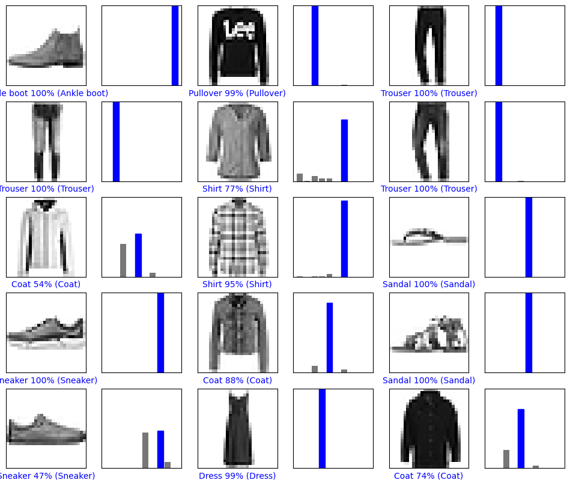

# TDDC17 - Artificial Intelligence

This repository contains solutions to labs from the course TDDC17 - Artificial Intelligence, at Linköping University.

## Intended Learning Outcomes

The aim of the course is to introduce concepts and applications of artificial intelligence (AI). The focus is on developing intelligent agent systems that can decide what to do and execute those actions. After the course, students will be able to explain, discuss, and apply artificial intelligence concepts such as:
- State space search algorithms
- Constraint satisfaction problems
- Machine learning
- Knowledge representation with propositional logic
- Probabilistic reasoning
- Automated planning

## Course Content

- Overview of AI and its applications.
- Search as a problem-solving method.
- Logic as a means of representing knowledge.
- Reasoning with incomplete information: nonmonotonic and probabilistic reasoning.
- Structured knowledge representation.
- Action planning and robotics.
- Strategies for automatic learning.
- Orientation in architectures for AI.

## [Lab 1 - Intelligent Agents](https://github.com/Abbasalubeid/Artificial-Intelligence/tree/main/lab1-intelligent-agents)
The purpose with this lab is to introduce the agent paradigm. The goal is to program an agent to autonomously clean a randomly generated world of various sizes, potentially with obstacles (black cells). The agent's goal is to clean all dirt (grey cells) and return to its starting position.

**Without obstacles (systematic exploration):**

**With obstacles (uses BFS):**

## Lab 2 - Search

## [Lab 3 - Supervised Deep Learning](https://github.com/Abbasalubeid/Artificial-Intelligence/tree/main/lab3-deep-learning)

This lab was mostly a tutorial on [TensorFlow](https://www.tensorflow.org) and how the theoretical part studied about suprevised deep learning like gradient descent and mini-batch sizes can be used in a project. The lab focused on building an image recognition model on the "Fashion MNIST" data set which is a set of product images from the clothing retailer Zalando.

