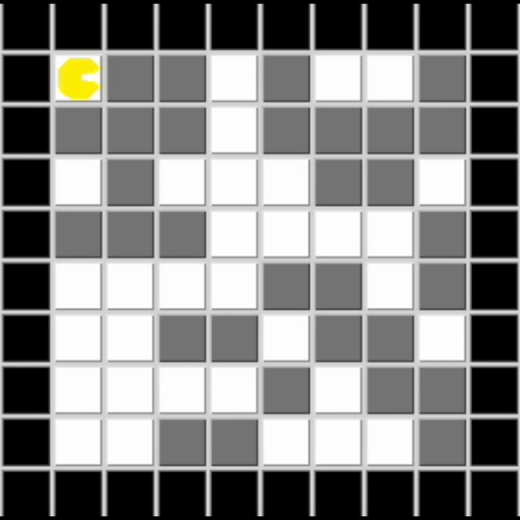
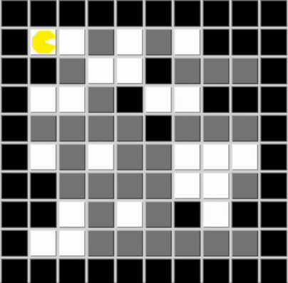

The purpose with this lab is to introduce the agent paradigm. The goal is to program an agent to autonomously clean a randomly generated world of various sizes, potentially with obstacles. The agent's goal is to clean all dirty squares and return to its starting position.

## Task 1

Task 1 was to make the agent start from a random location, suck up all dirt in a rectangular world of unknown dimensions without obstacles, and shut down on the home position (home position can be sensed through one of the percepts). At the end the agent should also have a fully updated world model (i.e. world variable in MyAgentState).

1.	Agent visits all cells in a rectangular path, starting from the map’s outer edges and progressively visiting inner “subrectangles.”
2.	Initially, boundaries are set according to the map’s dimensions.
3.	Random starting position of the agent is corrected by placing it to the right of the home position, facing east.
4.	Upon start, the agent moves east until hitting the east boundary, then turns right, adjusting the boundary.
5.	The agent continues this pattern: moving forward, hitting boundaries, turning right, and adjusting boundaries accordingly.
6.	This process shrinks the boundaries inward until the agent reaches the center, having visited all cells.
7.	When the center is reached, the agent is directed to go home, moving north until hitting a wall, then turning left to reach the home position.



## Task 2

In the second task, the approach was adapted to handle maps with obstacles. Since the agent cannot rely on moving in a rectangular pattern due to the presence of obstacles, a different strategy was required to explore the map, clean all dirt, and return to the home position.

The main idea was to use a Breadth-First Search (BFS) algorithm to systematically explore the map. The agent maintains a queue ```state.queue```, which stores unexplored neighboring cells along with their parent cells. At each step, the agent adds unknown neighboring cells to the queue.

The solution for task 2 also works for task 1, the agent visits all accessible cells and shuts down at the home position, whether there are obstacles or not.

The main decision loop is encapsulated in the ```next_move``` function. 

```python
def next_move():

   if home and self.state.go_home:
         self.log("Home and done!")
         self.iteration_counter = 0
         return ACTION_NOP

   update_queue()

   if not self.state.queue:
         self.log("The whole map is updated, lets go home")
         print("Add home to queue!")
         self.state.queue.append(((1,1), (1, 1)))
         self.state.go_home = True

   print("Queue :", self.state.queue)

   # If stack is not empty, we are on a path to a certain target
   if self.state.backtrack_stack:
         print("Stack not empty: ", self.state.backtrack_stack)
         target_x, target_y = self.state.backtrack_stack[-1]
   else:
         ((target_x, target_y), parent) = self.state.queue[0]

         if not directly_reachable(target_x, target_y) and not self.state.backtrack_stack:
            print("Target pos not reachable: ", target_x, target_y, " looking for path...")
            path = calculate_path(parent)
            if path:
               print("A path to the target: ", path)
               self.state.backtrack_stack.extend(path)
               target_x, target_y = self.state.backtrack_stack[-1]
               print("new stack with path to: ",parent, self.state.backtrack_stack)

            elif not path and (target_x, target_y) == (1, 1):
               print("No path to home...")
               self.iteration_counter = 0
               return ACTION_NOP


   print("Current Position: ({}, {}) Direction: {} Target: ({}, {})".format(
         self.state.pos_x, self.state.pos_y, self.state.direction, target_x, target_y))


   if target_x == self.state.pos_x and target_y == self.state.pos_y:
         # if the target was from the stack, pop the stack to move to next target in the next call
         if self.state.backtrack_stack:
            self.state.backtrack_stack.pop()
            print("Backtrack stack after pop: ", self.state.backtrack_stack)
         elif self.state.queue:
            self.state.queue.popleft()
            print("Queue after left pop: ", self.state.queue)
         self.state.last_action = ACTION_SUCK
         return ACTION_SUCK  # Do nothing
   elif target_x < self.state.pos_x and self.state.direction != AGENT_DIRECTION_WEST:
         return turn_right()
   elif target_x > self.state.pos_x and self.state.direction != AGENT_DIRECTION_EAST:
         return turn_right()
   elif target_y < self.state.pos_y and self.state.direction != AGENT_DIRECTION_NORTH:
         return turn_right()
   elif target_y > self.state.pos_y and self.state.direction != AGENT_DIRECTION_SOUTH:
         return turn_right()
   else:
         # if the target was from the stack, pop the stack to move to next target in the next call
         if self.state.backtrack_stack:
            self.state.backtrack_stack.pop()
            print("Backtrack stack after pop: ", self.state.backtrack_stack)
         else:
            self.state.queue.popleft()
            print("Queue after left pop: ", self.state.queue)

         print("Moving forward towards: ", target_x, target_y)
         return move_forward()
```


- The agent first checks if it should return home by evaluating the boolean ```state.go_home```, if true and the agent is at the home position, it stops execution.

- If the agent is not returning home, it calls the ```update_queue``` function to add new neighbors to the queue by checking the four neighboring cells (up, down, left, right) of the current position. 
   - If a neighbor is unknown or home and not already in the queue, it is added to the queue along with the current position as its parent. 
      - The parent is added so that we can calculate a path to that parent when we want to visit a certain cell.

- When the agent needs to move to a target position, it first checks if the target is directly reachable using the ```directly_reachable``` function. 
   -  If the target is not directly reachable, ```calculate_path``` is used to compute a path to the parent of the target using BFS.
   - ```calculate_path``` performs BFS starting from the current position. It uses a queue, a ```visited``` set to keep track of explored positions, and a ```came_from``` dictionary to reconstruct the path. 
      - When the target is found, the path is reconstructed by backtracking from the target to the start position using the ```came_from``` dictionary. 
      - The path is then stored in the ```state.backtrack_stack``` which the agent follows to reach the target.
- If the queue is empty, it means the agent has explored all accessible areas. In this case, the ```state.go_home``` is set to true and the home position is added to the queue.



# Notes

The agent paradigm is a key concept in Artificial Intelligence (AI) that models systems as autonomous entities called agents. These agents perceive their environment, make decisions, and act to achieve specific objectives. They can operate independently, whether in dynamic, unpredictable environments or in more stable, predictable ones.

## Types of Agents

- **Simple reflex agents**: Act only on the current situation, ignoring the history of percepts. Example: A vacuum cleaner that sucks dirt when it's dirty and moves when it's clean.
- **Model-based reflex agents**: Keep track of their environment's history using a model of the world.
- **Goal-based agents**: Choose actions to achieve specific goals (like a self-driving car reaching a destination).
- **Utility-based agents**: Focuses not only on goals, but also on the best way to achieve them by maximizing performance or overall effectiveness


## Environments

1. **Fully observable vs. Partially observable**:

   - **Fully observable**: The agent can access all relevant information about the environment. For example, in chess, the agent can see the entire board and all the pieces.
   - **Partially observable**: The agent only has partial information. A taxi driver can’t see the exact movements of all other cars or predict weather conditions perfectly.

2. **Single-agent vs. Multi-agent**:

   - **Single-agent**: The agent is the only decision-making entity (e.g., a vacuum cleaner robot).
   - **Multi-agent**: Multiple agents interact. This can be **competitive** (e.g., chess, where one agent’s gain is another’s loss) or **cooperative** (e.g., cars driving on the road, where avoiding collisions benefits all agents).

3. **Deterministic vs. Nondeterministic (Stochastic)**:

   - **Deterministic**: The next state is fully determined by the current state and the agent's action. For example, a chess game is deterministic.
   - **Nondeterministic**: There is uncertainty, and actions may have multiple possible outcomes. Driving in traffic is nondeterministic, you can’t predict how other drivers will behave.

4. **Episodic vs. Sequential**:

   - **Episodic**: The agent's experience is divided into independent episodes. For example, image recognition software treats each image independently.
   - **Sequential**: Current decisions affect future decisions. For instance, in driving, every turn and brake affects the overall journey.

5. **Static vs. Dynamic**:

   - **Static**: The environment doesn’t change while the agent is deciding. A crossword puzzle is static.
   - **Dynamic**: The environment changes over time, and the agent has to keep up. Taxi driving is dynamic, as traffic and weather can change while the agent is deciding.

6. **Discrete vs. Continuous**:

   - **Discrete**: The environment has a finite number of distinct states. Chess is discrete because there are a fixed number of moves and pieces.
   - **Continuous**: The environment has a range of states, often including continuous values. Taxi driving is continuous because it involves varying speeds, distances, and steering angles.

7. **Known vs. Unknown**:
   - **Known**: The agent knows how the environment works (its rules). For example, chess has known rules.
   - **Unknown**: The agent has to learn or figure out the rules of the environment. A taxi driver in a foreign country may face unknown traffic laws or road conditions.

### PEAS Framework

When designing an agent, you need to define its **task environment**. The PEAS framework helps categorize the agent's environment:

- **P**erformance measure: How do we measure the success of the agent? For example, a taxi-driving agent might be evaluated on getting passengers to their destination safely and quickly.
- **E**nvironment: What does the world look like for this agent? For a taxi, it could be roads, traffic, pedestrians, weather, etc.
- **A**ctuators: What can the agent do? For a taxi, actuators include steering, brakes, accelerator, etc.
- **S**ensors: What can the agent sense? A taxi uses cameras, GPS, speedometers, etc.

### **Examples of Task Environments**

The PEAS framework is applied to different agents:

- **Taxi driver**: The agent needs to drive safely, considering other cars, road conditions, passengers, and traffic laws. The environment is dynamic, partially observable, and multi-agent.
- **Medical diagnosis system**: This agent helps in diagnosing diseases based on patient symptoms. It operates in a partially observable environment where the state of the patient is not fully known.


