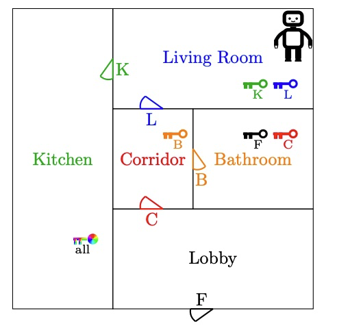

## Planning

This lab was about modeling a classical planning task to help a robot unlock a front door by defining actions for moving, picking up keys, and unlocking doors. We compared different search algorithms like greedy bfs and A* to find the most efficient plan for the robot.

